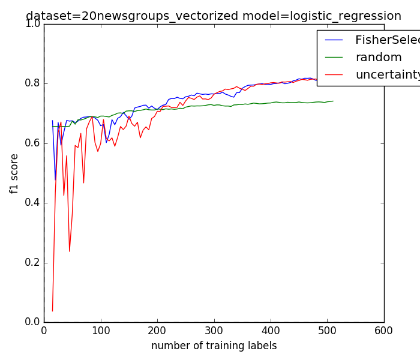
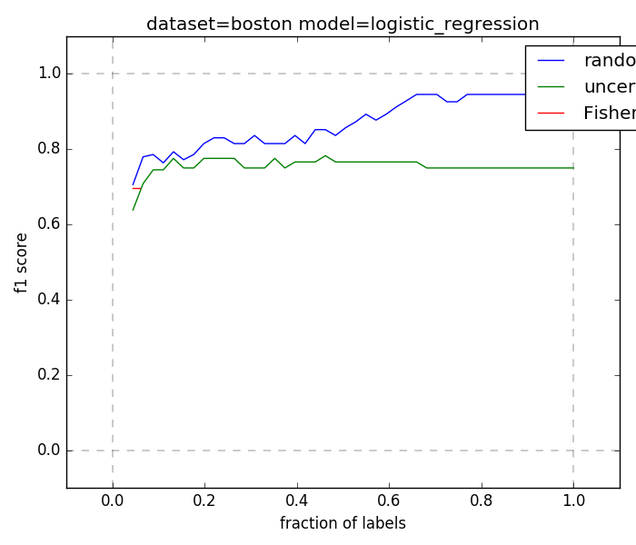
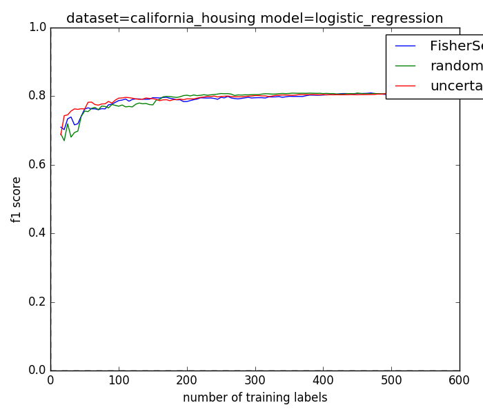

# Benchmarking Pool-Based Active Learning
Check out these [plots comparing active learning algorithms](results/overview.html)


#Results

See below plots


20-NewsGroups
-------------


Boston
-------------


California Housing
------------------



# Install
- Clone the repo

(We assume you're on python3 anaconda)


# Running
To run the active learning evaluation, type:

    ./run.sh

# Pushing a New Selector / New Model

Every active learning selector must expose a single function *next_indices* in order to 
work properly with the benchmarking tests. This function should return a list of length *n_ixs*

```python
class RandomSelector:
    """
        Returns random indices for sampling based on the
        data matrix X, previously sampled indices ixs,
        previously sampled labels Y_sub, and classifier model.
    """
    def next_indices(self,X,ixs,Y_sub,model,n_ixs=1):
        n = X.shape[0]
        remaining_ixs = list(set(range(n)) - set(ixs))
        n_to_sample = min(n_ixs,len(remaining_ixs))
        return random.sample(remaining_ixs,n_to_sample)

```


# What is this
Goal of puddle is to provide:
* an interface for implementing model-agnostic pool-based example-selector algorithms, for pool-based classification tasks
* a set of benchmarks to evaluate these selectors.  Benchmarks include specific datasets (vision, categorical, NLP), as well as specific models that perform well on these datasets

# Todo
* constrain goal of puddle formally ^.  What do we assume feature space representation is for modeling?  what do selectors have access to?  
    => maybe ability to get nearest neighbors?
* get this to run again (or find version that ran)
* add bert lstm classification benchmark
* add semi-supervised as well as active learning.  end-goal is pool-based transfer learning
* more benchmarks
    * amazon reviews?  
    * NER
    * image segmentation over satellite imagery (unet, spacenet etc?)?
    * standard image classification
    => goal is to be able to run these benchmarks efficiently

# References
* https://arxiv.org/pdf/1804.09170.pdf
* https://github.com/erikbern/ann-benchmarks
* burr settles active learning summary: http://burrsettles.com/pub/settles.activelearning.pdf
* some active learning py implementations: https://github.com/davefernig/alp

