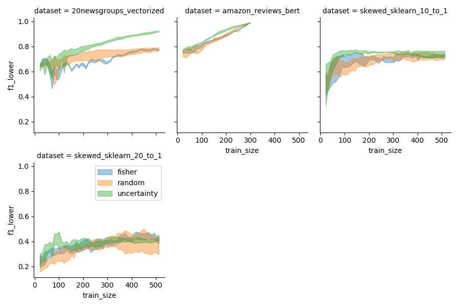

# Benchmarking Pool-Based Active Learning


### What is this?
Goal of puddle is to provide:
* an interface for implementing model-agnostic pool-based example-selector algorithms, for pool-based classification tasks
* a set of benchmarks to evaluate these selectors.  Benchmarks include specific datasets (vision, categorical, NLP), as well as specific models that perform well on these datasets

In this repository you will find a collection of benchmarks. Each benchmark is a unique combination of
- dataset (X, Y)
- model (classifier)
- selector


Check out these [plots](results/overview.html) for a list of all run benchmarks

#Results

Each benchmark run is configured by a few parameters:
```python
sample_size=10**6
epochs=50
labels_per_epoch = 5
n_ensemble=10
n_cpus=4
```

```sample_size``` deterimines the maximum number of datapoints to pull from each trial dataset.

```epochs``` determines the total number of selection opportunties given to the sequential
active learning ```Selector```. 

```labels_per_epoch``` is the number of labels pulled from the "pool" of X,Y during every epoch

```n_ensemble``` specifies the number of restarts for specific dataset-selector-model combination -- we enable this in order
to control for random seed/bootstrap effects, as the classifier models have to be instantiated with a few datapoints. 

```n_cpus``` controls the parallelism of the benchmark run. We use ```multiprocessing.pool.map(...)``` to distribute benchmarks across processes.


All Dataset-Selector-Model Combinations
--------------------



20-NewsGroups
-------------


Boston
-------------


California Housing
------------------


# Install
- Clone the repo

(We assume you're on python3 anaconda)


# Running
To run the active learning evaluation, type:

    ./run.sh

# Pushing a New Selector / New Model

Every active learning selector must expose a single function called ```next_indices``` in order to 
work properly with benchmarking tests. This function should return a list of indices that the selector would like to
 sample next the pool X, Y. Here is an example of a random selector

```python
class RandomSelector:
    """
        Returns random indices for sampling based on the
        data matrix X, previously sampled indices ixs,
        previously sampled labels Y_sub, and classifier, model.
    """
    def next_indices(self,X,ixs,Y_sub,model,n_ixs=1):
        """
            Return a index list of length n_ixs, randomly
            from the pool X. Exclude formerly sampled
            indices ixs.
            
        :param X: (array) Pool of feature vectors
        :param ixs: (list) List of formerly Labeled training indices
        :param Y_sub: (array(n,2)) Array of former labels, Y[ixs]
        :param model: Model class that is learning
        :param n_ixs: The number of next_indices to return
        """
        n = X.shape[0]
        remaining_ixs = list(set(range(n)) - set(ixs))
        n_to_sample = min(n_ixs,len(remaining_ixs))
        return random.sample(remaining_ixs,n_to_sample)

```


# What is this
Goal of puddle is to provide:
* an interface for implementing model-agnostic pool-based example-selector algorithms, for pool-based classification tasks
* a set of benchmarks to evaluate these selectors.  Benchmarks include specific datasets (vision, categorical, NLP), as well as specific models that perform well on these datasets

# Todo
* constrain goal of puddle formally ^.  What do we assume feature space representation is for modeling?  what do selectors have access to?  
    => maybe ability to get nearest neighbors?
* get this to run again (or find version that ran)
* add bert lstm classification benchmark
* add semi-supervised as well as active learning.  end-goal is pool-based transfer learning
* more benchmarks
    * amazon reviews?  
    * NER
    * image segmentation over satellite imagery (unet, spacenet etc?)?
    * standard image classification
    => goal is to be able to run these benchmarks efficiently

# References
* https://arxiv.org/pdf/1804.09170.pdf
* https://github.com/erikbern/ann-benchmarks
* burr settles active learning summary: http://burrsettles.com/pub/settles.activelearning.pdf
* some active learning py implementations: https://github.com/davefernig/alp

